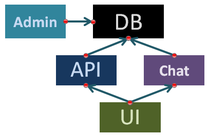

# New-Portfolio-Application

### My portfolio app for JS Developer and Front-end Developer job position.
## ( In proccess planning ... )

# Global Design planning

## Technologies
- ui - [React](https://reactjs.org/), [RxJS](https://rxjs-dev.firebaseapp.com), [Redux](https://redux.js.org/), [Redux-Observable](https://redux-observable.js.org/), [SASS](https://sass-lang.com)
- api - [NodeJS](https://nodejs.org), [Koa](https://koajs.com)
- chat - [Socket IO](https://socket.io)
- db - [MongoDB](https://mongodb.com), [Mongoose](https://mongoosejs.com)
- admin - [NodeJS](https://nodejs.org), [Express](https://expressjs.com), [Pug (Jade)](https://pugjs.org), [mongojs](https://github.com/mafintosh/mongojs)
- domain & hosting - [Heroku](https://www.heroku.com)