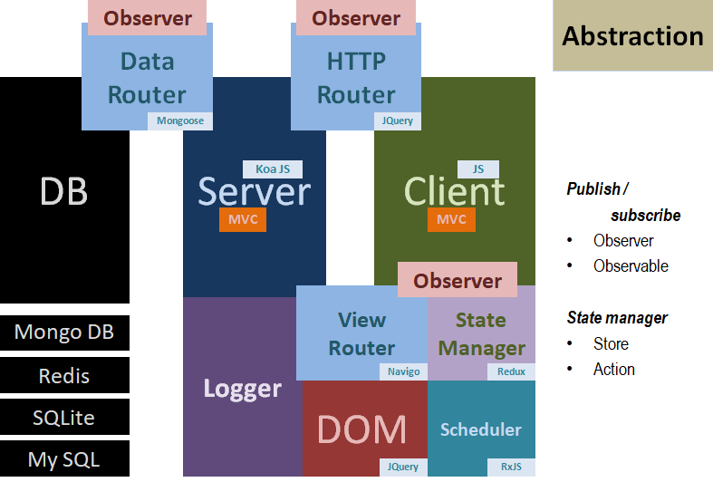

# Design planning

## Global

## Modular abstraction

## UI

- (3) abstract models - CollectionObject, Profile, State
- (3) abstract sub-models - Article, User, Session
- (3) article collections - VideoPost, BlogPost, ChatSession
- (1) profile collection - User & UserSession
- (3) abstract states (with section) - BlogRoom, ChatRoom, VideoRoom
- (n) sections - JS, NodeJS, RxJS etc.
